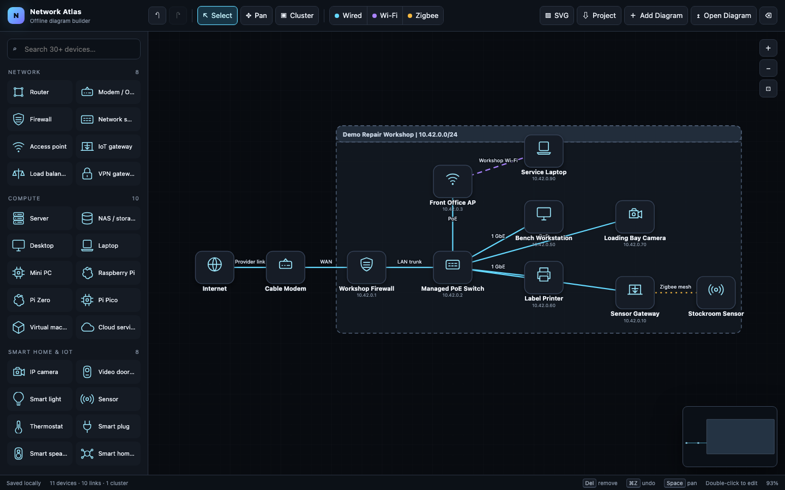
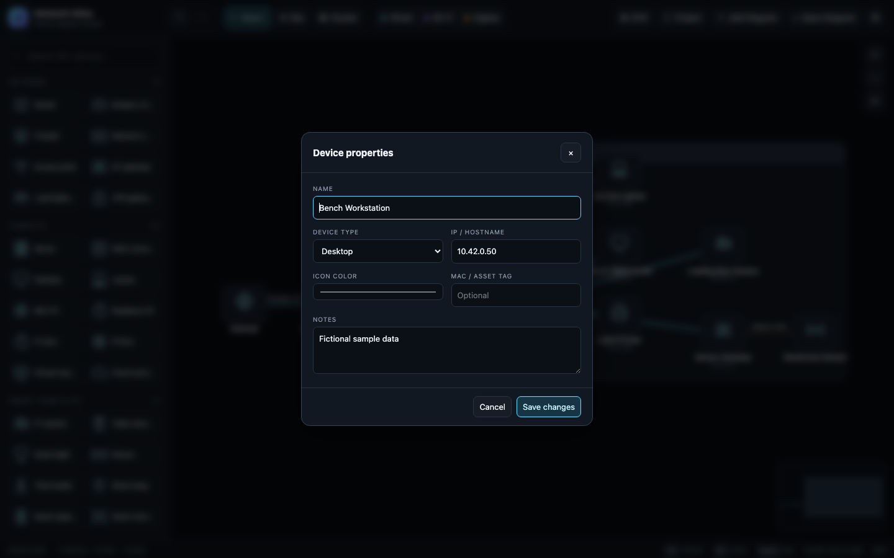

# Network Atlas

Network Atlas is a network diagram builder contained in one HTML file. Open it in a browser and start drawing. There is no account, no cloud service, no analytics, and no subscription.

If a diagram tool needs your email address before it lets you draw a box and a line, something has gone wrong.

You can read a little more behind this project over at my website, [blog.liam0nster.com](https://blog.liam0nster.com/notes/network-atlas-offline-network-diagrams/).

## Screenshots

## Use it

1. Download `index.html`.
2. Open it in a current browser. * *Note this may require the latest version of your browser. In testing, this does not work on Chrome 147* *
3. Drag devices onto the canvas.
4. Export the project JSON when you want a real backup.

That is the install process. There is not one.

## What it does

- Includes icons for common network, compute, smart home, endpoint, and power devices
- Draws wired, Wi-Fi, and Zigbee connections
- Adds named and resizable clusters
- Edits devices and connections by double-clicking them
- Supports pan, zoom, multi-select, copy, paste, undo, and redo
- Saves the current diagram in browser storage
- Exports editable project JSON and presentation-ready SVG
- Opens a project as a replacement or adds one to the current diagram
- Runs without external scripts, fonts, or network access

The included repair workshop diagram is fictional sample data. It is there to show the controls, not to document a real network.

## Project files

Use **Project** to download editable JSON.

Use **Open Diagram** to replace the current project. The app warns you first.

Use **Add Diagram** to merge another project into the current one. Imported IDs are remapped and the added diagram is placed beside the existing layout.

Browser storage is convenient, but it is not a backup. Export the JSON if the diagram matters.

## GitHub Pages

This repository needs no build step. Enable GitHub Pages for the repository root and `index.html` will be the site.

## Privacy

Diagram data stays in the browser unless you export it yourself. Network Atlas does not scan networks, upload diagrams, or contact a server.

## Contributing

Keep it dependency-free and useful offline. Small, understandable changes are preferred over adding a framework for the sake of having one.

## Affiliation
This project is open-source and not affiliated with SolarWinds.

## License

BSD 3-Clause. Redistributions must retain the copyright and license notice crediting Liam0nster. See [LICENSE](LICENSE).
